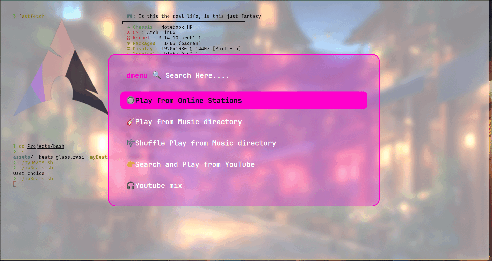

# 🎶 myBeats

**myBeats** is a Bash script that lets you play music using [Rofi](https://github.com/davatorium/rofi) as a stylish menu frontend and [mpv](https://mpv.io) as the audio player.
It supports local playback, online radio stations, YouTube search, and even custom YouTube mixes — all from your terminal with a clean UI.

---

## 📸 Screenshot



---

## ✨ Features

- 🎵 Play music from local directories
- 🔀 Shuffle play from your music library
- 📻 Stream from online radio stations
- 🔍 Search and play music directly from YouTube
- 🧠 Create and play automatic YouTube Mixes

---

## ⚙️ Requirements

Make sure the following tools are installed:

- [`rofi`](https://github.com/davatorium/rofi)
- [`mpv`](https://mpv.io/)
- [`yt-dlp`](https://github.com/yt-dlp/yt-dlp)
- `notify-send` (for desktop notifications)

---

## 📦 Installation

### 🔷 On Arch Linux / Manjaro:

```bash
sudo pacman -S rofi mpv yt-dlp libnotify
```

Optional: Ensure xorg-xmessage or an equivalent is installed for full desktop notification support if needed.

### 🔶 On Ubuntu / Debian:

```bash
sudo apt update
sudo apt install rofi mpv yt-dlp libnotify-bin
```

---

## 🚀 Usage

1. Make the script executable:

```bash
chmod +x myBeats.sh
```

2. Run the script:

```bash
./myBeats.sh
```

3. Choose from the Rofi menu:

- 🎧 Play from Music Directory
- 🔀 Shuffle Play
- 📻 Online Stations
- 🔍 YouTube Search
- 🧠 YouTube Mix

---

## 🔧 Configuration

Edit the script to match your setup:

```bash
mDIR="$HOME/Music"         # Path to your local music folder
iDIR="$HOME/.config/icons" # Path to your music icon (optional)
rofi_theme="mytheme.rasi"  # Path to your custom Rofi theme
```

---

## 🛠 Optional Improvements

You can also:

- Create a `.desktop` launcher for easy access from your app menu
- Add keyboard shortcuts to trigger myBeats
- Customize the Rofi theme for better aesthetics

---

## 📄 License

This project is licensed under the MIT License — see the [LICENSE](LICENSE) file for details.

---

## 🙌 Contributing

Pull requests, suggestions, and improvements are welcome!
If you find bugs or have ideas for new features, feel free to open an issue or submit a PR.
- Or just start with a ⭐ star :)

---

Enjoy your terminal tunes with myBeats!
